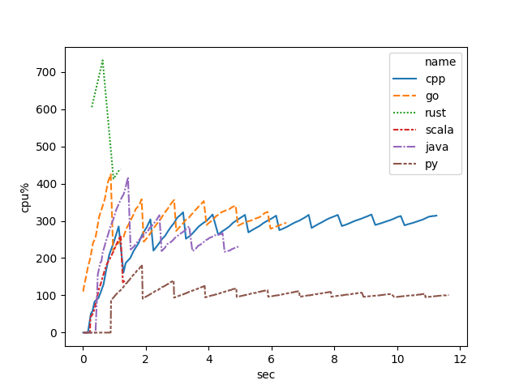
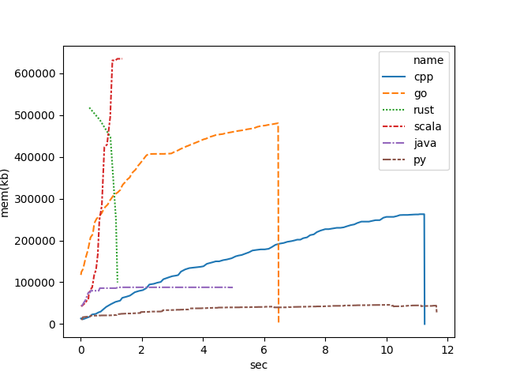
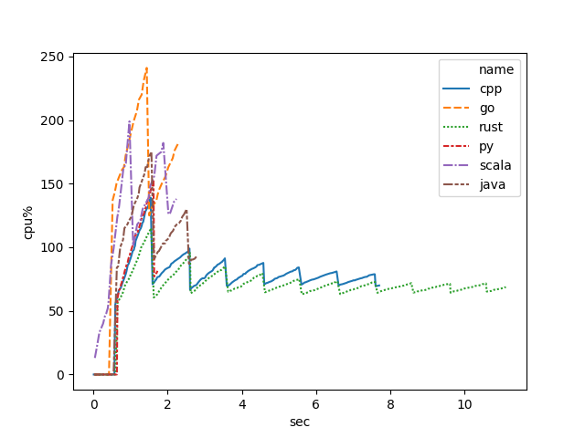
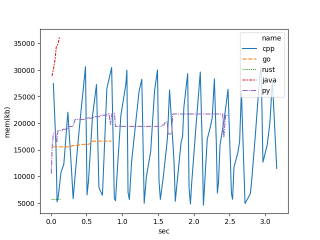
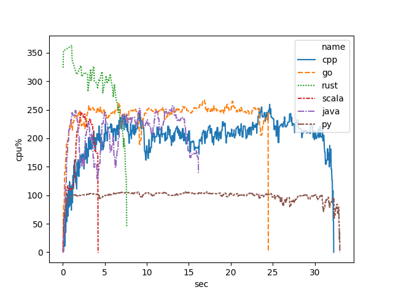
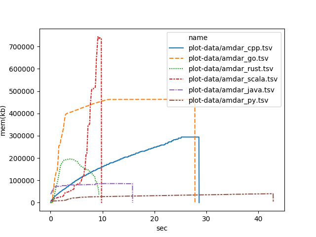
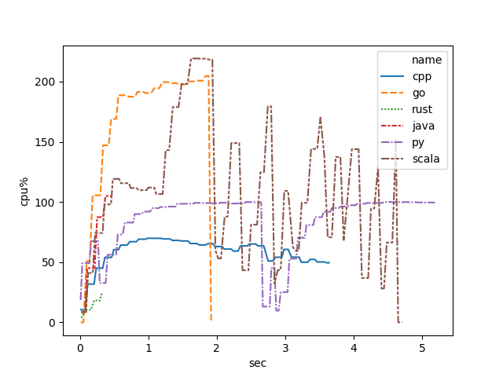
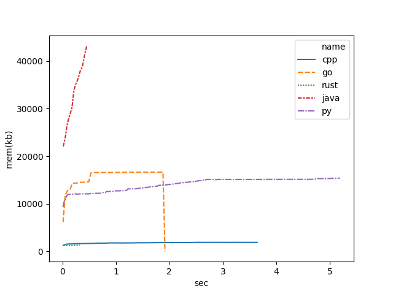

# Compare Language


## Language

* python
* Java
* Scala
* Golang
* C++
* Rust
* (TODO) Haskell, erlang


## Requirements Tools

- jdk
- sbt
- cargo (rust)
- gcc or others
- make
- go
- python (and requirements.txt packages for graph.png)


## Performance Check List

### Matrix Calculation

N x N の行列積計算処理を start から end まで並列処理

```
for n in start ... end:
  thread matrix[n][n] x matrix[n][n]
```

### Read File

wcコマンドと同じような処理（厳密に実装していない）を作成して、
引数で指定したファイルを順次読み込んで、wc 処理を実行

```
files = [file1, file2, file3 ... ]
for n in 0 ... end :
   thread word_count file[n % files.length]
```

### IO Socket

POSTでテキストファイルを送信して、wc 処理を結果を返す
webapp に ab (apache becnh)を実行

```
httpd:
  "/" http_request > word_count > http_response
```

```
# client
$ ab -p word_count.txt http://.....
```

## Hardware Info

```
Hardware:

    Hardware Overview:

      Model Name: Mac mini
      Model Identifier: Macmini5,1
      Processor Name: Intel Core i5
      Processor Speed: 2.3 GHz
      Number of Processors: 1
      Total Number of Cores: 2
      L2 Cache (per Core): 256 KB
      L3 Cache: 3 MB
      Memory: 8 GB
      Boot ROM Version: MM51.0080.B00
      SMC Version (system): 1.76f0
      Serial Number (system): C07JH05RDJD2
      Hardware UUID: 48862FF2-0DD0-541F-8A3D-265F17048E24
```

```
Linux Mint

model name	: Intel(R) Core(TM) i7-4790 CPU @ 3.60GHz
processor	: 0
processor	: 1
processor	: 2
processor	: 3
MemTotal:       10753172 kB

```

## Performance Result

### Linux

#### Matrix Calculation

cpu usage




memory usage



#### word count

cpu usage




memory usage




### MacOS

cpu usage




memory usage



#### word count

cpu usage




memory usage




## Each Language Profile


### python

cProfile

### java

- jhat, jstack, jps, hprof

### golang

go tool pprof
