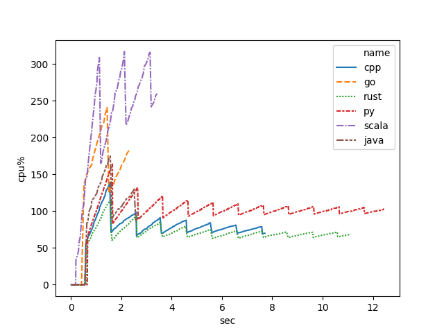

# 運動会


## Entry

* python
* Java
* Scala
* Go
* C++
* Rust
* (TODO) Haskell


## Performance Check List


### Calculation

ok: py, java, scala, go,rust, cpp

### Read File


ok:  go, java, scala, py
ng:  rust, cpp


### IO Socket

http

ok:  
ng:  go, py,  rust, cpp, java, scala


### (TODO) Synchronized


## Reference


Rust

* https://rust-lang-ja.github.io/the-rust-programming-language-ja/1.6/book/concurrency.html


## Hardware Info

```
Hardware:

    Hardware Overview:

      Model Name: Mac mini
      Model Identifier: Macmini5,1
      Processor Name: Intel Core i5
      Processor Speed: 2.3 GHz
      Number of Processors: 1
      Total Number of Cores: 2
      L2 Cache (per Core): 256 KB
      L3 Cache: 3 MB
      Memory: 8 GB
      Boot ROM Version: MM51.0080.B00
      SMC Version (system): 1.76f0
      Serial Number (system): C07JH05RDJD2
      Hardware UUID: 48862FF2-0DD0-541F-8A3D-265F17048E24
```

## Performance

### Linux

#### amdar

cpu usage


memory usage


#### word count

cpu usage




memory usage


