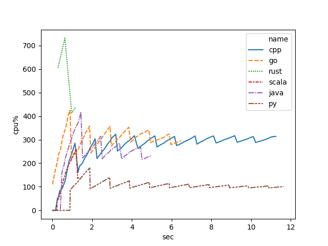
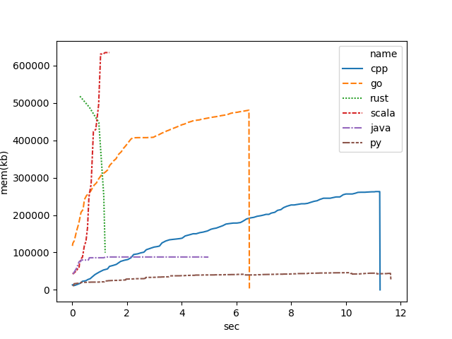
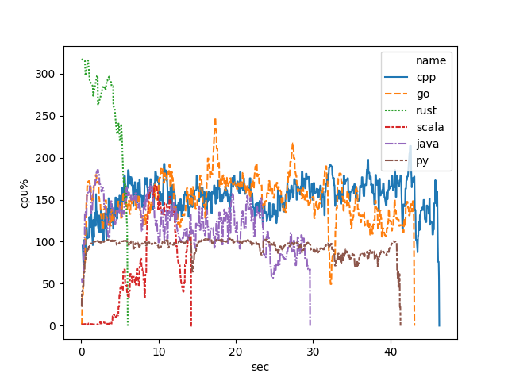
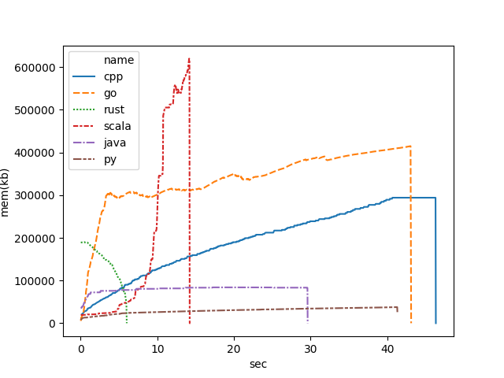
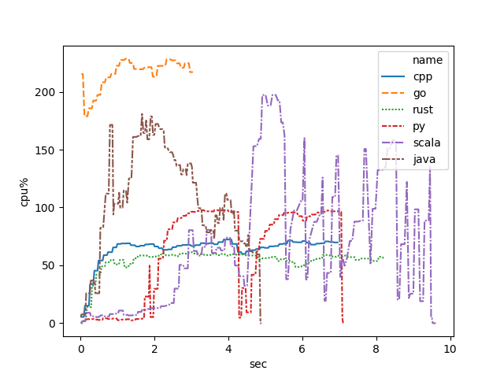

# Result


## Hardware Info

```
Hardware:

    Hardware Overview:

      Model Name: Mac mini
      Model Identifier: Macmini5,1
      Processor Name: Intel Core i5
      Processor Speed: 2.3 GHz
      Number of Processors: 1
      Total Number of Cores: 2
      L2 Cache (per Core): 256 KB
      L3 Cache: 3 MB
      Memory: 8 GB
      Boot ROM Version: MM51.0080.B00
      SMC Version (system): 1.76f0
      Serial Number (system): C07JH05RDJD2
      Hardware UUID: 48862FF2-0DD0-541F-8A3D-265F17048E24
```

```
Linux Mint

model name	: Intel(R) Core(TM) i7-4790 CPU @ 3.60GHz
processor	: 0
processor	: 1
processor	: 2
processor	: 3
MemTotal:       10753172 kB

```

## Performance Result

### Linux

#### Matrix Calculation

cpu usage




memory usage



#### word count

cpu usage


memory usage


### MacOS

cpu usage




memory usage



#### word count

cpu usage




memory usage


